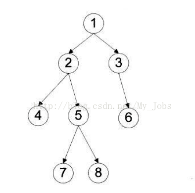

### 105. 从前序与中序遍历序列构造二叉树

给定两个整数数组  preorder 和 inorder ，其中  preorder 是二叉树的先序遍历， inorder  是同一棵树的中序遍历，请构造二叉树并返回其根节点。

输入: preorder = [3,9,20,15,7], inorder = [9,3,15,20,7]
输出: [3,9,20,null,null,15,7]

输入: preorder = [-1], inorder = [-1]
输出: [-1]

- 1 <= preorder.length <= 3000
- inorder.length == preorder.length
- 3000 <= preorder[i], inorder[i] <= 3000
- preorder  和  inorder  均 无重复 元素
- inorder  均出现在  preorder
- preorder  保证 为二叉树的前序遍历序列
- inorder  保证 为二叉树的中序遍历序列

知识点：首先要知道一个结论，前序/后序+中序序列可以唯一确定一棵二叉树，所以自然而然可以用来建树。

- 前序遍历：根结点 ---> 左子树 ---> 右子树 所以前序遍历的第一个元素一定是根节点
- 中序遍历：左子树---> 根结点 ---> 右子树 所以中序遍历的根节点一在中间位置
- 后序遍历：左子树 ---> 右子树 ---> 根结点
- 层次遍历：只需按层次遍历即可

二叉树特点：

- 左边的数据一定比右边的大

建二叉树的基本思路就是先构造根节点，再构造**左子树**，接下来构造**右子树**，
其中，构造**左子树**和**右子树**是一个子问题，递归处理即可。
因此我们只关心如何构造根节点，以及如何递归构造左子树和右子树。

1. 前序中左起第一位 1 肯定是根结点，我们可以据此找到中序中根结点的位置 rootin；
2. 中序中根结点左边就是左子树结点，右边就是右子树结点，即[左子树结点，根结点，右子树结点]，我们就可以得出左子树结点个数为 int left = rootin - leftin;；
3. 前序中结点分布应该是：[根结点，左子树结点，右子树结点]；
4. 根据前一步确定的左子树个数，可以确定前序中左子树结点和右子树结点的范围；
5. 如果我们要前序遍历生成二叉树的话，下一层递归应该是：
   - 左子树：root->left = pre_order(前序左子树范围，中序左子树范围，前序序列，中序序列);；
   - 右子树：root->right = pre_order(前序右子树范围，中序右子树范围，前序序列，中序序列);。
6. 每一层递归都要返回当前根结点 root；

举例一颗二叉树

前序遍历：[1,2,4,5,7,8,3,6]
中序遍历: [4,2,7,5,8,1,3,6]
后序遍历: [4,7,8,5,2,6,3,1]
层次遍历：[1,2,3,4,5,6,7,8]

```python
# Definition for a binary tree node.
# class TreeNode:
#     def __init__(self, val=0, left=None, right=None):
#         self.val = val
#         self.left = left
#         self.right = right
class Solution:
    def buildTree(self, preorder: List[int], inorder: List[int]) -> TreeNode:
        # 边界处理
        if len(inorder) == 0:
            return None
        # 根据前序遍历可以找到 root
        root = TreeNode(preorder[0])
        # 找到root在中序遍历的位置
        idx = inorder.index(preorder[0])
        # 根据中序遍历以及前序遍历的特点， (中序)左子树 - root - 右子树  (前序）root - 左子树 - 右子树
        #                   - 则左子树： inorder[:idx]    preorder[1:idx+1]
        #                   - 则右子树：inorder[idx+1:]  preorder[idx+1:]
        # 构建左子树
        root.left = self.buildTree(preorder=preorder[1:idx+1],inorder=inorder[:idx])
        root.right = self.buildTree(preorder=preorder[idx+1:],inorder=inorder[idx+1:])

        return root


```
