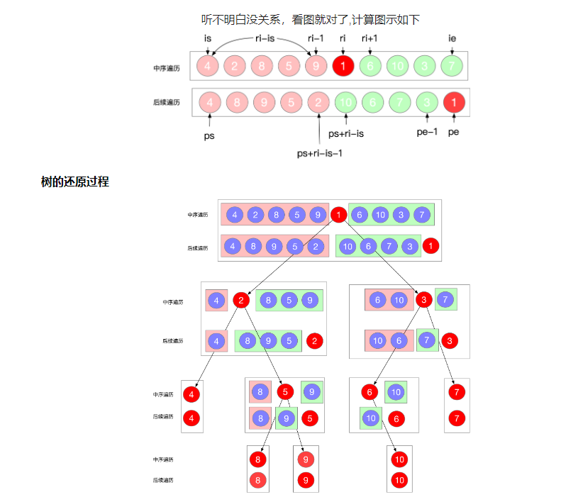

### 106. 从中序与后序遍历序列构造二叉树

给定两个整数数组 inorder 和 postorder ，其中 inorder 是二叉树的中序遍历， postorder 是同一棵树的后序遍历，请你构造并返回这颗   二叉树  。

输入：inorder = [9,3,15,20,7], postorder = [9,15,7,20,3]
输出：[3,9,20,null,null,15,7]

输入：inorder = [-1], postorder = [-1]
输出：[-1]

和 105. 从前序与中序遍历序列构造二叉树 大同小异：前/后 + 中 序遍历可以确认一颗二叉树

知识点：

- 前序遍历：根结点 ---> 左子树 ---> 右子树 所以前序遍历的第一个元素一定是根节点
- 中序遍历：左子树---> 根结点 ---> 右子树 所以中序遍历的根节点一在中间位置
- 后序遍历：左子树 ---> 右子树 ---> 根结点
- 层次遍历：只需按层次遍历即可

找到一张比较好解释的图：


```python
# Definition for a binary tree node.
# class TreeNode:
#     def __init__(self, val=0, left=None, right=None):
#         self.val = val
#         self.left = left
#         self.right = right
class Solution:
    def buildTree(self, inorder: List[int], postorder: List[int]) -> TreeNode:
        if len(inorder) == 0:
            return None
        # root 一定在后序遍历的最后
        root = TreeNode(postorder[-1])
        # 寻找到 root 在中序遍历的位置
        idx = inorder.index(postorder[-1]) # idx 也代表了左子树元素个数的数量

        # 构造左子树  边界处理
        root.left = self.buildTree(inorder[:idx], postorder[:idx])
        # 构造右子树
        root.right = self.buildTree(inorder[idx+1:], postorder[idx:-1])

        return root

```

go 版本

```go
/**
 * Definition for a binary tree node.
 * type TreeNode struct {
 *     Val int
 *     Left *TreeNode
 *     Right *TreeNode
 * }
 */
func buildTree(inorder []int, postorder []int) *TreeNode {
    if len(inorder) == 0 {
        return nil
    }

    // root 一定在后序遍历的最后
    root := &TreeNode{postorder[len(postorder) - 1],nil,nil}
    // 找到root在中序遍历的位置
    idx := 0
    for;idx<len(inorder);idx++{
        if inorder[idx] == postorder[len(postorder) - 1]{
            break
        }
    }
    // 构造左子树
    root.Left = buildTree(inorder[:idx], postorder[:idx])
    // 构造右子树
    root.Right = buildTree(inorder[idx+1:], postorder[idx:len(postorder)-1])

    return root

}

```
